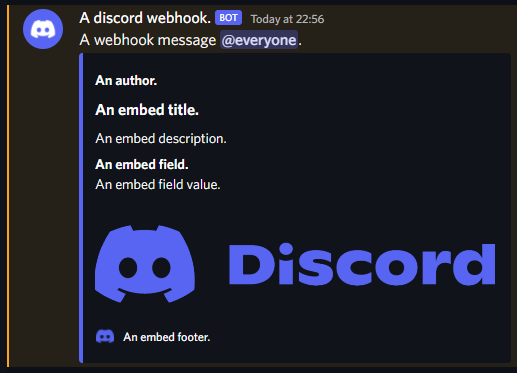

# Discord-Webhook-DotNET
A simple .NET library for posting Discord webhooks.

## Installation
Grab the [latest release](https://github.com/ReadieFur/Discord-Webhook-DotNET/releases/latest) and add it to your project.  
Make sure you also have the required dependencies listed below too.
### Dependencies:
- [Newtonsoft.Json](https://github.com/JamesNK/Newtonsoft.Json)

## Usage:
The structure of this Webhook class follows the same as the one listed on the [Discord API](https://discord.com/developers/docs/resources/webhook#execute-webhook).  
When creatign a webhook, at least one of the following properties must be set:  
- `content`
- `embeds`
- `file`

More information on properties you can set can be read on the [Discord webhook API documentation](https://discord.com/developers/docs/resources/webhook#execute-webhook).  
### Example:
In this example we will create an embedded message and send it to a Discord webhook.  
This full example can be found in the [DiscordWebhook.Test](./DiscordWebhook.Test) project.
```csharp
//Create a new webhook instance with your webhooks id and token. Obtained from '.../webhooks/{webhook.id}/{webhook.token}'.
Webhook webhook = new Webhook(id, token);

//Attatch some files (10 at most) (returns the file ID) and then get the attatchment URL -> attachment://{id}.
string discordLogoFileAttatchmentURL = Webhook.GetAttatchmentURLForFile(await webhook.AddFile("./resources/DiscordLogo.png"));
string discordFileAttatchmentURL = Webhook.GetAttatchmentURLForFile(await webhook.AddFile("./resources/Discord.png"));

//Override the server set webhook avatar and username.
//webhook.avatarUrl = discordLogoFileAttatchmentURL; //Cannot be an attatchment URL.
webhook.username = "A discord webhook.";

//Set some plain text content and enable TTS.
webhook.content = "A webhook message @everyone.";
webhook.tts = true;

//Add a mention parser, in this example we will parse the {webhook.content} for @everyone.
Mention mention = new Mention();
mention.AddParse(Mention.EParseOptions.everyone);
webhook.allowedMentions = mention;

//Add an embed. Up to 10 can be added.
webhook.AddEmbed(new Embed
{
    title = "An embed title.",
    description = "An embed description.",
    color = 5793266,
    footer = new Footer("An embed footer.") { iconUrl = discordLogoFileAttatchmentURL },
    image = new Media(discordFileAttatchmentURL),
    author = new Author("An author."),
    fields = new List<Field> { new Field("An embed field.", "An embed field value.") }
});

//Post the webhook and wait for the response.
HttpResponseMessage response = await webhook.Send();
```
This will result in a message posted to your Discord server that looks like this:
